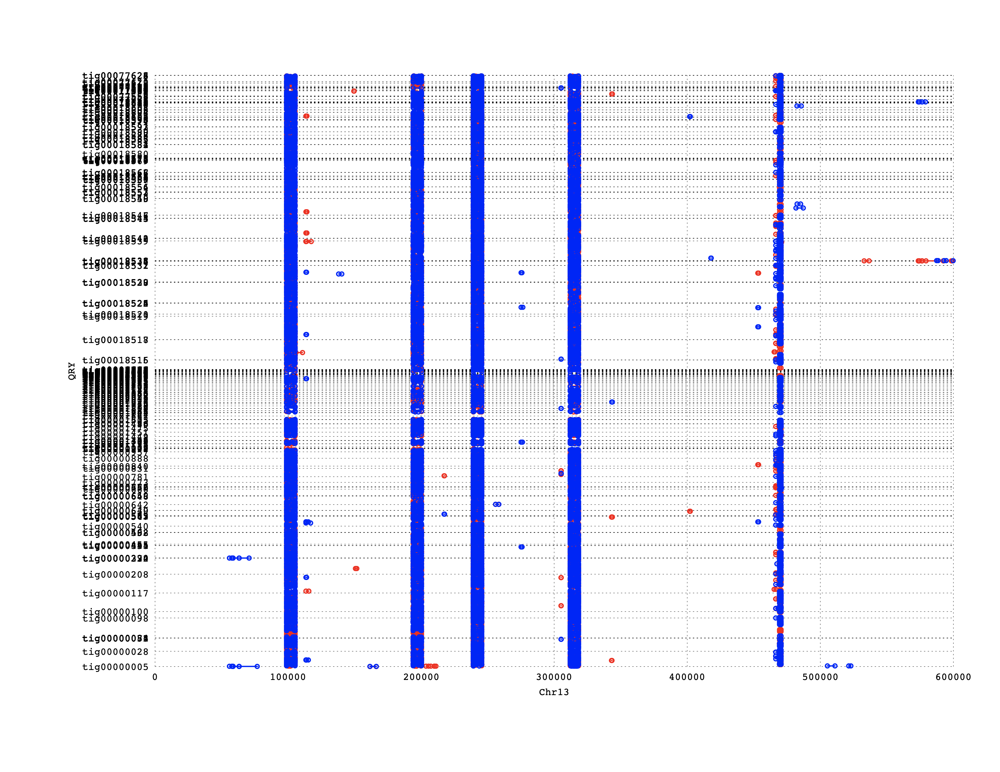
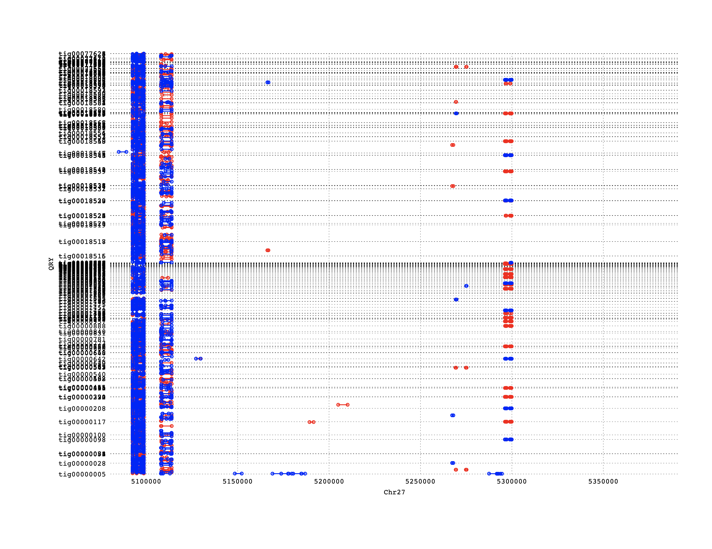

# synteny between the Physcomitrella and the Physcomitrium FR1 and FR2 ?

We compair Physcomitrella and the Physcomitrium genome sequence use nucmer command:

```shell
thread=8
x=nucmer
bsub -q rock -n $thread -e lsf.err -o lsf.out -J $x -R "span[hosts=1]" /share/home/baishenglong/programs/mummer-4.0.0beta2/nucmer --maxmatch --minmatch 50 --mincluster 100 Physcomitrella.fa Physcomitrium.fasta --prefix $x -t $thread

module load glibc/2.14

egrep 'Chr24|Chr27' /share/home/baishenglong/database/Physcomitrella_patens/JGI_v3.3/assembly/Ppatens_318_v3.fa.fai | awk '{print $1"\t"$2"\t+"}' > Chr24_Chr27.id

/share/home/baishenglong/programs/mummer-4.0.0beta2/mummerplot -p Chr24_Chr27_tig00000005 -R Chr24_Chr27.id -q tig00000005 --postscript nucmer.delta; ps2pdf Chr24_Chr27_tig00000005.ps; imgcat Chr24_Chr27_tig00000005.pdf

/share/home/baishenglong/programs/mummer-4.0.0beta2/mummerplot -p liwanxian_FR1 -r Chr13 --postscript -x [0:600422] nucmer.delta; ps2pdf liwanxian_FR1.ps; imgcat liwanxian_FR1.pdf # FR1: Chr13 14225:527422
/share/home/baishenglong/programs/mummer-4.0.0beta2/mummerplot -p liwanxian_FR2 -r Chr27 --postscript -x [5080386:5391530] nucmer.delta; ps2pdf liwanxian_FR2.ps; imgcat liwanxian_FR2.pdf # FR2: Chr27 5180386:5291530
```

- liwanxian_FR1.png



- liwanxian_FR2.png


